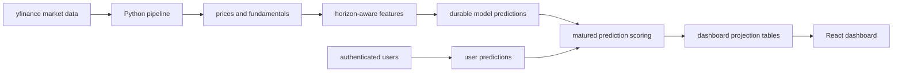

# Ticker Wars

[Live demo](https://tickerwars.vercel.app)

Ticker Wars is a portfolio machine-learning project that turns stock forecasting into a
scoreable competition between baseline models, classical ML models, optional foundation
forecasting adapters, and user predictions.

The interesting part is not that it "beats the market." It does not claim to. The project is
about building the kind of data and evaluation system that makes forecasting claims measurable:
daily market ingestion, horizon-aware feature generation, durable prediction storage, delayed
scoring after target dates mature, and a React dashboard that explains model performance without
requiring a reviewer to inspect raw tables.

This project is not financial advice, a trading strategy, or a production investment system.

## What Users Can Do

- Browse latest model predictions for stocks across `1W`, `1M`, `3M`, and `1Y` horizons.
- Compare models on MAE, directional accuracy, interval quality, and scored prediction count.
- Inspect ticker pages with actual-vs-predicted charts and confidence interval bands.
- Submit personal predictions, track active vs settled picks, and compare public leaderboard
  results.
- View model detail pages, ticker detail pages, public profiles, badges, and gamified prediction
  history.

## ML And Data Pipeline

The backend pipeline is written in Python and is designed around time-aware prediction contracts.
Each run:

1. Fetches missing or recently corrected OHLCV bars from yfinance.
2. Caches fundamentals and ticker logo metadata where available.
3. Builds bounded, in-memory features from historical price rows.
4. Scores predictions whose target dates have matured.
5. Generates fresh predictions for each configured horizon.
6. Refreshes narrow dashboard projection tables for the frontend.
7. Exports static JSON snapshots as a fallback/dashboard artifact.



The key design choice is that predictions are stored before outcomes are known. Scoring happens
later, after the target close is available, which avoids accidentally evaluating against data that
was not available at prediction time.

## Modeling Approach

Ticker Wars intentionally includes a mix of model types so the dashboard can compare simple,
interpretable baselines against heavier approaches:

- **Baseline**: predicts no price movement.
- **Linear Regression** and **Random Forest**: classical tabular models trained on derived price
  features.
- **Warren Buffbot**: a toy LLM comparison model that uses cached fundamentals and value-investing
  style prompt context. It is intentionally labeled experimental.
- **TimesFM** and **Chronos-2**: optional time-series foundation model adapters. They are disabled
  by default because they add heavier dependencies, model downloads, and runtime constraints.

The pipeline supports all models across `1W`, `1M`, `3M`, and `1Y` horizons.

## Evaluation

The dashboard separates prediction horizon from evaluation metrics. A `1M` prediction is judged
only after its target date matures and the actual close is known.

Displayed metrics include:

- **MAE**: mean absolute error in dollars.
- **Directional accuracy**: whether the model predicted the correct up/down direction.
- **Winkler interval score**: rewards confidence intervals that are both narrow and calibrated.
- **Scored count**: how many matured predictions are included in a metric row.

This framing keeps the project honest: small samples, volatile assets, and noisy markets are
visible in the scoring tables instead of hidden behind a single cherry-picked metric.

## Architecture

- **Python pipeline**: ingestion, feature generation, model execution, scoring, dashboard refresh,
  and snapshot export.
- **Supabase Postgres**: durable prediction store, user prediction system, projection tables, RLS
  boundaries, and public dashboard reads.
- **React + TypeScript frontend**: dashboard, model pages, ticker pages, prediction flows, public
  profiles, and gamification UI.
- **GitHub Actions / Supabase automation**: scheduled private pipeline runs and live price refresh
  operations in the production project.

Reviewer-facing schema documentation lives in [docs/database-schema.md](docs/database-schema.md).
The curated public schema lives in [supabase/schema.sql](supabase/schema.sql).

## What I Learned

- Forecasting projects need durable prediction records before they need fancy models.
- Evaluation windows, prediction horizons, and target-date resolution are easy to blur unless they
  are represented explicitly in the schema.
- A useful ML dashboard often depends on projection tables, not raw normalized tables, because the
  browser needs fast and narrow read contracts.
- Optional foundation-model adapters are best isolated behind feature flags and dependency extras.
- Public portfolio repos benefit from a curated schema and docs story rather than a noisy migration
  trail from every experiment.

## Limitations

- yfinance is an unofficial data source and can have delays, corrections, missing fields, or
  occasional API issues.
- Stock forecasting is noisy; the project is built to evaluate predictions, not to recommend
  trades.
- Some model results can be based on small matured samples, especially for longer horizons.
- TimesFM and Chronos-2 are optional and may require large downloads or specific runtime setup.
- Warren Buffbot is a deliberately experimental LLM comparison, not a serious investment analyst.

## Run Locally

Install backend dependencies:

```bash
python -m pip install -e ".[dev]"
```

Install frontend dependencies:

```bash
cd frontend
npm install
```

Create local environment files from the examples and provide Supabase values if you want live
dashboard data:

```bash
cp .env.example .env
```

```bash
cd frontend
npm start
```

More detailed setup notes are in [docs/local-development.md](docs/local-development.md).

## Tests

```bash
python -m pytest
```

```bash
cd frontend
npm test -- --watchAll=false
npm run build
```

Pipeline command details are in [docs/pipeline.md](docs/pipeline.md). Deployment and automation
notes are intentionally kept out of the README and summarized in
[docs/deployment-notes.md](docs/deployment-notes.md).

## Repository Note

The public portfolio repository is intended to be named `ticker-wars`. Some internal package names
still use the earlier `next-day-price` project name to avoid unnecessary churn during cleanup.
