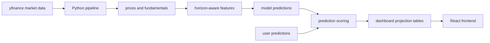

# Ticker Wars

[Live demo](https://tickerwars.vercel.app)

Ticker Wars is a competitive stock forecasting platform that pits users against machine learning models.

This project is not financial advice, a trading strategy, or a production investment system.

## What Users Can Do

- Compare models and users on MAE, directional accuracy, interval quality, and scored prediction count.
- Browse latest model and user predictions for stocks across `1W`, `1M`, `3M`, and `1Y` horizons.
- Inspect ticker pages with actual-vs-predicted charts and confidence interval bands.
- Submit personal predictions, track active vs settled picks, and compare public leaderboard
  results.
- View model detail pages, ticker detail pages, public profiles, badges, and gamified prediction
  history.

## ML And Data Pipeline

The backend pipeline is written in Python and is designed around time-aware prediction contracts.

Each run:

1. Fetches missing or recently corrected ticker data from yfinance.
2. Caches fundamentals and ticker logo metadata where available.
3. Builds in-memory features from historical price rows.
4. Scores predictions that have matured since the last run.
5. Generates fresh predictions for enabled models across configured horizons.
6. Refreshes dashboard projection tables for the frontend.
7. Exports static JSON snapshots as a fallback.



## Modeling Approach

I tried to include a range of models from classic ML models to foundation time-series models. I was limited by a $0 budget.

In the future I would like to add a baseline that predicts every asset to appreciate with inflation, and 
a baseline that predicts the historical average. These are the models that are currently supported by the pipeline:

- **Baseline**: predicts no price movement.
- **Linear Regression** and **Random Forest**: classical tabular models trained on derived price
  features.
- **TimesFM** and **Chronos-2**: time-series foundation model adapters. They are disabled
  by default because they add heavier dependencies, model downloads, and runtime constraints.
  They are enabled in the live demo.

The pipeline supports all models across `1W`, `1M`, `3M`, and `1Y` horizons.

## Evaluation

The dashboard separates prediction horizon from evaluation metrics. 
A prediction is judged only after its target date matures and the actual close is known.

Displayed metrics include:

- **MAPE**: mean absolute percent error.
- **Directional accuracy**: whether the model/user predicted the correct up/down price direction.
- **Winkler interval score**: rewards confidence intervals that are both narrow and calibrated.

## Architecture

- **Python pipeline**: ingestion, feature generation, model execution, scoring, dashboard refresh,
  and snapshot export.
- **Supabase Postgres**: prediction store, user prediction system, projection tables, RLS
  boundaries, and public dashboard reads.
- **React + TypeScript frontend**: landing, dashboard, model pages, ticker pages, prediction flows, public
  profiles and a rules page.
- **GitHub Actions / Supabase automation**: scheduled private pipeline runs and live price refresh
  operations via Supabase Edge Functions.

Schema documentation lives in [docs/database-schema.md](docs/database-schema.md).

## What I Learned

- It is surprisingly easy and cheap (free) to automate a ML training pipeline with Github Actions.
- Forecasting projects need durable prediction records before they need fancy models.
- Evaluation windows, prediction horizons, and target-date resolution are easy to blur unless they
  are represented explicitly in the schema.
- A useful ML dashboard often depends on projection tables, not raw normalized tables, because the
  browser needs fast and narrow read contracts.

## Limitations

- yfinance is an unofficial data source and can have delays, corrections, missing fields, or
  occasional API issues.
- Stock forecasting is very noisy and nobody is particularly good at it.
- Some model results can be based on small matured samples, especially for longer horizons.
- The project has a $0 budget

## Run Locally

Install backend dependencies:

```bash
python -m pip install -e ".[dev]"
```

Install frontend dependencies:

```bash
cd frontend
npm install
```

Create local environment files from the examples and provide Supabase values if you want live
dashboard data:

```bash
cp .env.example .env
```

```bash
cd frontend
npm start
```

More detailed setup notes are in [docs/local-development.md](docs/local-development.md).

## Tests

```bash
python -m pytest
```

```bash
cd frontend
npm test -- --watchAll=false
npm run build
```

Pipeline command details are in [docs/pipeline.md](docs/pipeline.md). 
Deployment and automation notes are summarized in [docs/deployment-notes.md](docs/deployment-notes.md).
